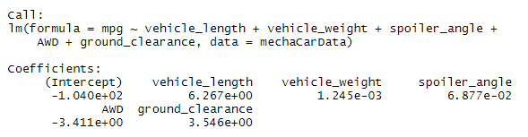
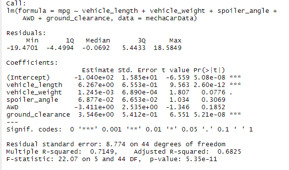
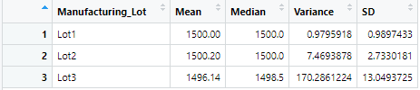
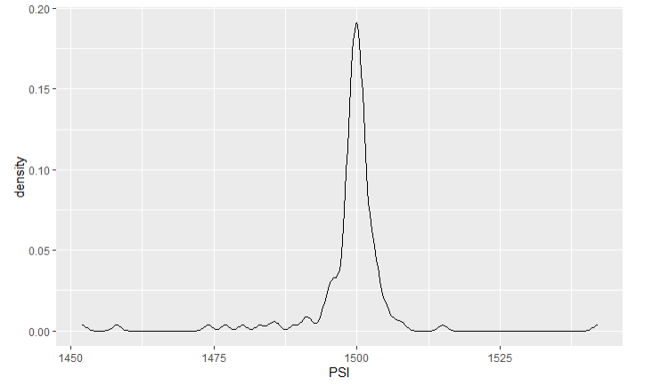
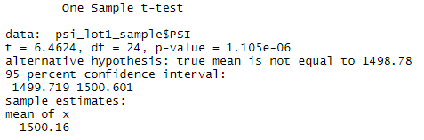
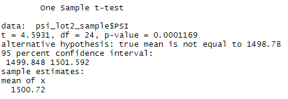
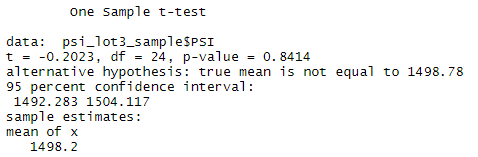

# MechaCar_Statistical_Analysis
## Project Overview  
  •	This project involves the use of statistics and hypothesis testing to analyze a series of datasets from the automotive industry.  
  •	All the statistical analysis and visualizations is written in the R programming language.  
  •	Fuel efficiency (MPG): Fuel efficiency is a measure of how far a vehicle can travel per unit of fuel. Fuel efficient vehicles require less gas to go a given distance.  Because less fuel is required to cover a journey, fuel-efficient cars save more money for drivers in the long-term. In the USA, fuel efficiency is expressed as "miles per gallon" (mpg). The question is whether the mpg of MechaCars is better than other competitors or not?  
## Tools and Techniques
  •	R-programming, R-Studio (R-notebook), tidyverse, ggplot2, Statistical Tests, Hypothesis Tests

## Deliverable 1 - Linear Regression to Predict MPG
Generate a multi-factor linear regression using the "lm" function, to predict a dependent variable: "MPG" based on 5 independent variables: 
(vehicle_length + vehicle_weight + spoiler_angle + AWD + ground_clearance)  
  •	Since there was no feature selection in this model, we will see that some variables are less relevant to include in the model.   
  •	For the overall model, we see that we have a R-squared of .7149 which mean that this model with our given dataset, our five independent variables can explain about **71%** of what determines (mpg). Which in general, is a satisfactory model to use. This model can be improved by simply including more effective variables to explain our dependent variable (mpg) through data collection.   
  •	Our model rejects the "null hypothesis" that the slope is zero, since the relationship between our Y (MPG) and our independent variables is not zero for some of the variables analyzed below. Our alternative hypothesis says that our intercept does not equal zero which is true.    

### Independent Variable Analysis (P-value):
1.	vehicle_lenght
  . P-value of about 0 shows that is statistically significant to this model.
2.	vehicle_weight
  . P-value of about 0.0776 shows that is statistically significant to this model if we assume a higher level of alpha (.1 instead of .05).  Usually alpha is set at 0.05 (5%)
3.	spoiler_angle
  . P-value of .3069 shows that is NOT statistically significant.  Therefore, we will not include in this model.
4.	ground_clearance
  . P-value of about 0 shows that is statistically significant to this model.
5.	AWD
  . P-value of .3069 shows that is NOT statistically significant.  Therefore, we will not include in this model.	

Hence, the variables/coefficients that provided a **non-random** amount are "vehicle_length", "ground_clearance" and "vehicle_weight" (if we assume alpha at .1) to "mpg".  The intercept has a value of -104.
### The equation:
mpg = [(6.27) * vehicle_length] + [(1.25e-3) * vehicle_weigth] + [(6.88e-2) * spoiler_angle] + [(-3.41) * AWD] + [3.55 * ground_clearance] - (1.04e+2)
### Approximate to:
mpg = [(6.27) * vehicle_length] + [(-3.41) * AWD] + [(3.55)] * ground_clearance] + (-104)
As, R-square is 0.71 so 71% of the variations in mpg can be explained by changes in the vehicle length, the vehicle weight, the spoiler angle, the drivetrain, and the ground clearance. 
We can consider this linear model as efficient to predict mpg of MechaCar prototypes.  The p-value of the linear model was 5.35e-11 which is smaller than the assumed significance level of .05%, so we reject that null hypothesis, and accept the alternative hypothesis that the model has a slope. Consider running another model using only the two variables that are non-random to "MPG": vehicle_length and vehicle_weight.
### Summary Statistics Table:

## Deliverable 2 - t-test on Suspension Coils
## Suspension Coil t-test 
In this case, the one-sample t-test has been used to assert if there is a statistical difference between the means of a sample dataset (suspension coil's pound-per-inch) and hypothesized, potential population dataset. The mean of the hypothesized, potential population dataset is given as 1,500 pounds per inch.
Assuming the significance level of 0.05 percent, the p-value (0.06028) is above our significance level. The data is considered to have normal distribution. Therefore, we do not have sufficient evidence to reject the null hypothesis, and we would state that the two means are statistically similar.   

  
Lot Summary

### Design test of variance must *NOT* exceed 100 pounds per inch
As per summary table below, the metrics are: Mean = 1498.78, Median = 1500 and Variance = 62.293656, with STD = 7.8926.  

Summary Stats Table of Population

The mean and the median are nearly the same.  Hence, we can assume the dataset has a normal distribution and a zero skewness. This can visually be seen by the plot below.  

Distribution PSI vs. Density

The design specifications for the MechaCar suspension coils dictates that the variance of the suspension coil must NOT exceed 100 pounds per inch.  Based on the t-test, the variance is about 62.29 pounds per inch which is below the specified value.  Hence, the current manufacturing data meets the design specification.
Now, population means can never be known but just for this case there is one in place to gather some insight on pounds per square inch per Lot. Let see if the lot are statistically significant/ different from the predetermined population mean of 1500.

### Lot 1 vs. Population Mean:
The t-test has a p-value of 0.9048, that is not statistically significant: so, we do not have enough evidence to reject the "null hypothesis".  Lot#1 and Population mean are statistically similar.  

### Lot 2 vs. Population Mean:
The t-test has a p-value of 0.3451, that is not statistically significant: so, we do not have enough evidence to reject the "null hypothesis".  Lot#2 and Population mean are statistically similar.  

### Lot 3 vs. Population Mean:
The t-test has a p-value of 0.637, that is not statistically significant: so, we do not have enough evidence to reject the "null hypothesis".  Lot#3 and Population mean are statistically similar.  

  

## Study Design
  •	Increase the test by adding different categorical car data (SUV, sports car, Pickups).  
  •	Compare MechaCar dataset against the competitor’s dataset to establish that there is a statistical difference between MechaCar and Non-MechaCars products. We want to reject our null hypothesis that there is not a difference between the two groups (MechaCars and Competition) and accept our alternative that there is a difference between the two groups.  The null hypothesis is that the means of mpg of all groups are equal, and the alternative hypothesis is that at least one of this means is different from all other groups.  
  •	Conduct some ANOVA test among various manufacturers versus MechaCars, analyzing more ownership factors: MPG, maintenance, depreciation, horsepower, reliability and so on. With ANOVA the tests are done individually so some car types might or might not be statistically significant.  
  •	Further explore more data: As the intercept on our linear model was statistically significant, that might be other variables and factors (not included in this dataset), that might contribute to the variation in (Miles per Gallon) "MPG".  
